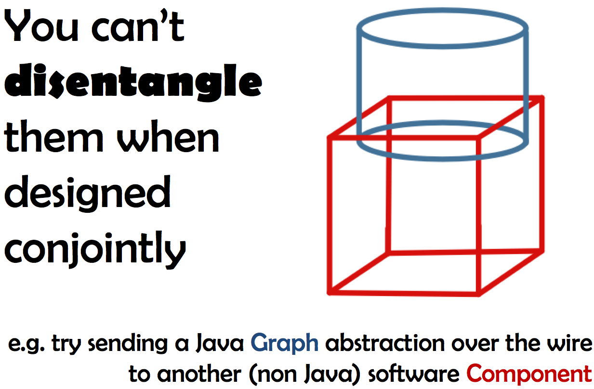
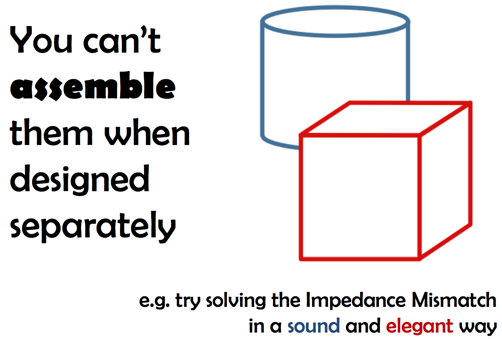
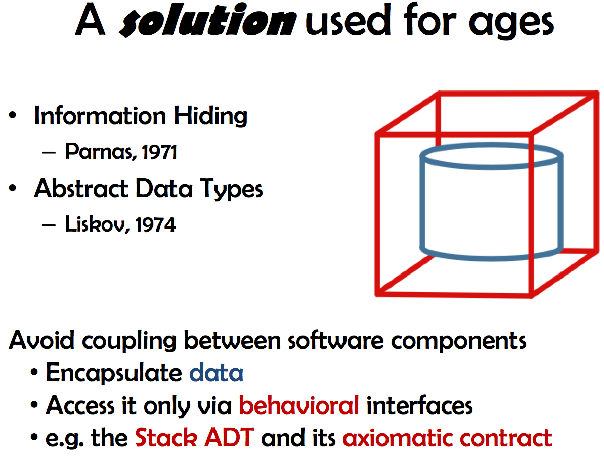
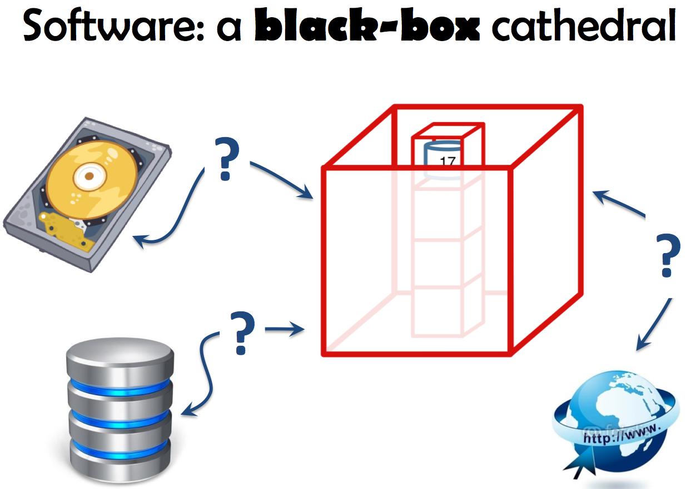
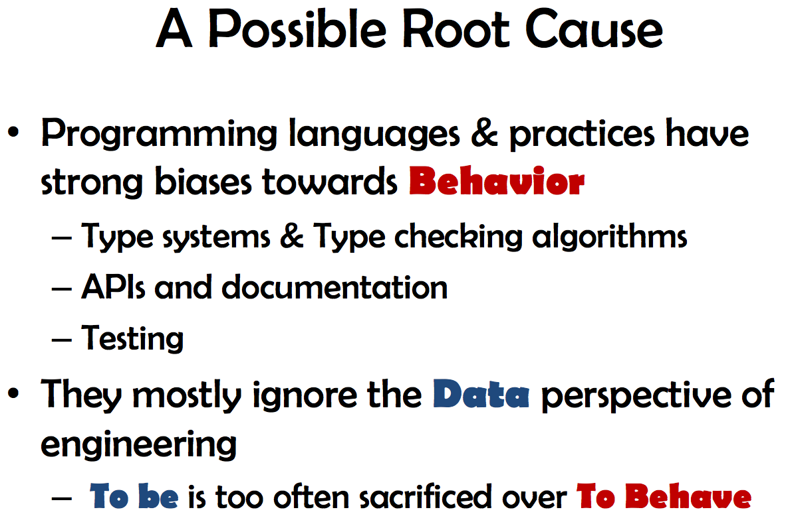
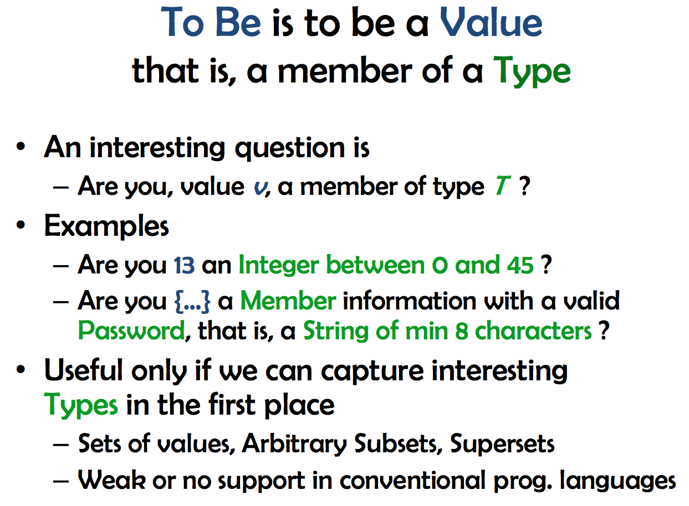

---
layout:
  blog
---
# Data Deserves a Language Too

July 17, 2014

I was at [csv,conf](http://csvconf.com/) last week, where I gave a short talk
about Finitio. I really enjoyed reading Aaron Schumacher's [transcript of his
own talk "Data and
Truth"](https://github.com/ajschumacher/data_and_truth#data-and-truth), so
here I decided to do something similar here. My slides can also be found on
[Slideshare](http://www.slideshare.net/BernardLambeau/data-deserves-a-language-too).
Last, the [try page here](/try) has been entirely refactored for the occasion.
It is now powered by [finitio.js](http://github.com/llambeau/finitio.js) in
such a way that you can try Finitio on simple to complex examples by yourself
with the same ease. The talk now.

 I started working on Finitio, a *data* language, because too often I ended up in troubles when attempting to mary *data*, here represented in blue, and code, or say *behavior* or *computation*, represented in red.

 When designed conjointly data and code abstractions cannot be easily separated. Suppose for instance a graph abstraction, say in Java, that is a Java object, ot better, an instance of some Graph interface. You'll have a hard time extracting the graph information, that is, the data itself, to send it somewhere, or save it to a file. You'll have to deconstruct the graph in some way (see later).

 Marrying data and code abstractions after they have been designed separately is not easier. The so-called *impedance mismatch*, the difficulty of reconciling relational databases and object-oriented programming, provides a striking example. I'm still personally trying to find a solution that would be both sound from a *database* point of view (no, [ORMs are not](http://revision-zero.org/some-orm-haters-do-get-it)) and elegant from a *software engineering* point of view. See my other main project, [Alf](http://github.com/alf-tool), and its [Relations as First-Class Citizen](http://www.try-alf.org/blog/2013-10-21-relations-as-first-class-citizen) paradigm about that specific topic.

 The coupling issue between data and code, that makes them inseparable, is known for a very long time. More than 40 years ago now, Wirth explained that making programs involves carefully designing data structures and algorithms *together*, so that the result is both correct and efficient. Of course, it may quickly lead to high coupling between different software components themselves (or small Programs if you want), if ones implements them against concrete data structures.

 How mitigating that risk is known for ages too, and called *information hiding*; *abstract data types* (ADTs) provide the best example of applying information hiding. An ADT encapsulates data and only exposes a behavioral interface (an *axiomatic contract*, when it comes to defining its semantics). Think of the `Stack` contract, e.g. with the `push`, `pop` (command) and `top`, `size` (query) methods.

 Now, if you think about it for a minute, you'll quickly discover that information hiding, as applied nowadays, leads to very strong blackboxes with repect to data. It aims at hiding data *representations* (i.e. which concrete data structures are used) but ends up hiding *data*, the *information* itself.

Take the example on the slide. If you're lucky enough here, maybe you'll see that a <code>Stack</code> is used in the software. Its public interface will also tell you that <code>17</code> is on its top and that it has <code>4</code> elements, but that's all. You'll have to deconstruct the stack to get the full data it encapsulates.

Now, suppose new data requirements come in, such as adding configuration files, or persistence. Or you may want to distribute the software; doing so involves data <em>exchanges</em> between components. I hope it's clear enough now, you'll have to deconstruct the software, by design.

Information hiding, that aims (and succeeds) at easing with software evolution through loose coupling, actually hurts evolution too. Yet information hiding is not about hiding <em>domain</em> information, but about hiding <em>design decisions</em>. What we observe is a nasty side effect, not an intent; we can hopefully find a solution.

 Before any hope of improvement, it is necessary to better understand the root cause(s) of the situation here. One of them, in my opinion, has to be found in the strong bias of programming languages towards behavior (or *computation*, if you want). Type systems in particular are designed not to capture data types, but to prevent wrong computations, by enabling compile-time or runtime type checking. Don't get me wrong, it is not a *problem*, only a *bias* towards behavior at the expense of data.

 In contrast, working with data calls for capturing arbitrary sets of values, and arbitrary subsets of them, and supersets, regardless of behavior or computation *per se*.

Think to databases, configuration files, data exchanges, input forms, and so on. In many such cases, what you want is capturing very precise sets of values, as in the examples on the slide. This is what capturing data is about, making <em>consistency</em> precise. There is no behavior involved in that, at least at first glance. A friendly type system for those tasks should probably not be designed towards guaranteeing safe <em>behavior</em> in the first place. It should allow you to capture interesting sets of values, that's it.

 Hence this talk. And hence Finitio. What would a *data* language look like? What useful abstractions can we invent if we forget about 
behavior and (static) type checking for a minute, and focus on precisely capturing interesting sets of values instead.

<em>Data</em> Deserves a Language Too.

There are existing data languages out there, including data <em>exchange</em> languages, such as JSON, XML, ... and CSV of course. But if something has to be borrowed from the programming language world, it's the fact that programming languages are strongly rooted on very sound mathematical foundations (especially if you consider functional programming, e.g. various lambda calculi). We need such a strong foundation for data languages too.

 Finitio aims at providing an example of such a language. It comes with nice features to capture, document, coerce and validate data in various, concrete, situations such as making simple yet safe data exchanges in distributed and heterogeneous software systems.

I'm still early in the process of designing Finitio, and providing it with a sound and clear semantics. It's mostly a nice type system so far, with great support for coercing and uncoercing data. I've at heart of designing it to interoperate with existing data exchange and programming languages. Have a look at <a href="/reference/latest/information-contracts">Information Contracts</a> for an example of what can be done towards this. Later, I will also certainly integrate some ideas of my other data project, <a href="http://www.try-alf.org/" target="_blank">Alf, my flavor of relational algebra</a>.

The rest of the talk was a live demonstration of Finitio. You can walk through the different examples on the <a href="/try" target="_blank">try page</a> by yourself. I'll try to make those examples more self-contained as soon as I've got a minute!
